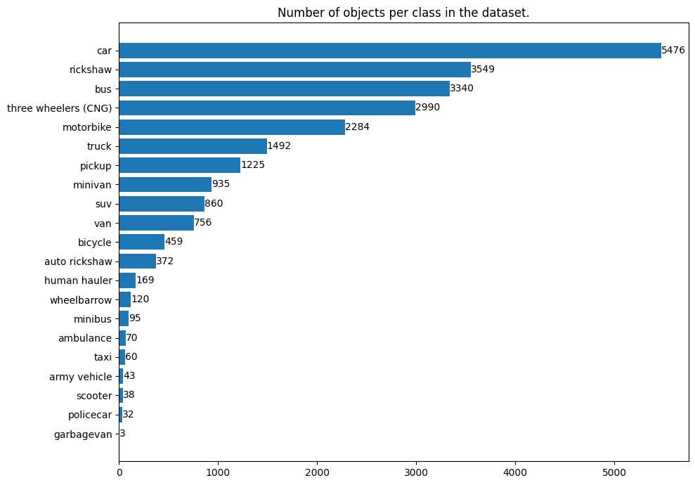

# Question 03 - vehicle detection model with custom dataset

## Problem statement
> The objective is to predict the location and type of vehicle found in the scene using the images provided. The images have annotations in xml format, and the task is to create an Object Detector and Classifier.Eg: Cars, Bus, Motorbikes etc. Select 3 or 4 classes from the provided dataset and build the training module. Each Image may or may not have the classes to identify.

## Dataset
* The custom vehicle dataset for the problem statement: https://www.kaggle.com/datasets/pratikbarua/vehicle-detection-dataset
* The dataset contains 3003 images with corresponding annotation 3003 xml files and 500 unannotated images for testing.
* The dataset has been annotated for 21 vehicle categories, such as car, ricksaw, bus, truck, motorbike, bicycle, garbagevan, etc,.
* The class distribution as number of objects per class in the whole dataset is given below.

  
## Solution
### Model selection
* Training an object detection model from scratch is a resource-intensive and time-consuming process. Since the limited amount of data or computational resources, it might be more efficient to use transfer learning with a pre-trained model and fine-tune it on the given custom dataset.
* Selecting the proper object detection algorithm for detecting vehicles in real-world images depends on various factors, including accuracy, speed, and resource requirements. Here, I'll compare three popular object detection algorithms like YOLO, SSD, and Faster R-CNN.

	1. **YOLO:** It is known for its real-time object detection capabilities. YOLO's one-stage detection approach makes it very fast, suitable for real-time applications. It has shown competitive accuracy in detecting objects, including vehicles in open datasets. The simplicity of YOLO makes it easy to implement and deploy. It might have difficulty detecting small vehicles or objects. In some cases, YOLO might not achieve the same precision as other detectors like Faster R-CNN.

	2. **SSD:** SSD is another real-time object detection algorithm that directly predicts bounding boxes and class scores at multiple scales using a series of convolutional layers. SSD can achieve real-time inference on GPUs, making it suitable for applications requiring fast detection. It provides a good trade-off between speed and accuracy. SSD's feature pyramid allows better detection of small vehicles compared to YOLO. It can require more training data to perform optimally compared to YOLO.

	3. **Faster R-CNN:** It is a two-stage detection approach that uses a region proposal network (RPN). Faster R-CNN typically achieves higher accuracy compared to YOLO and SSD, making it well-suited for tasks requiring high precision.The architecture of Faster R-CNN can make it slower during inference compared to YOLO and SSD. It can be more resource-intensive, requiring more computational power for training and inference.

* Since there are no latency constrain and real-time application mentioned in the question, the better performing model based on accuracy would be pre-trained Faster R-CNN based models.
* On the other hand, for better performance with a balance between speed and accuracy and for limited computational resources, going for YOLO models or SSD based models pre-trained like SSD Mobilenet v2 or SSD ResNet50.

### Data preprocessing
* Performing EDA and data preprocessing on the given image dataset, to ensure that dataset is well-prepared for training and to enhance the model's ability to detect vehicles accurately and generalize well to unseen data.
* The image data analysis like image size (width and height) distribution in the given dataset helps in deciding correct input size for the model.
* For the simplicity and baseline submission, only 4 classes from the whole 21 class dataset are selected and processed.
* The selected classes are "bus", "car", "rickshaw", "three wheelers (CNG)".
* The bounding box annotations should be in a format compatible with the object detection model of choice. Common formats include COCO JSON, Pascal VOC XML, or YOLO TXT format. The give dataset contains xml format.
* The neccessary steps sholud be done like resizing and normalizing the pixel values ([0,1] or [-1,1]) for training and data augumentation for improving the model's generalization.
* Manual inspection of random sample of annotated images to ensure the accuracy of the bounding box annotations.
* The dataset (after selecting only 4 classes) consists of 2701 images and it is splited into training and validation sets with 80:20 ratio. The unlabeled test set given in the original dataset is uesd for evaluation tasks.
* A [data_preparation.py](data_preparation.py) script is written to convert xml annotations to YOLO txt format and create proper folder for training.

### Training
* The opensource pre-trained YOLOv6s model from [this repo](https://github.com/meituan/YOLOv6) is used for training the baseline submission model.
* The training is done in Google Colab environment with Nvidia T4 GPU using Python 3.X, Pytorch verions. The training steps are followed from the custom data training instructions given [here](https://github.com/meituan/YOLOv6/blob/main/docs/Train_custom_data.md).
* This baseline model is trained with batch size of 4 for 5 epochs. The trained input image size is 640x640.
* The training scope and model performance can be increased with more experimental iterations of hyperparameter tuning and training.

### Evaluation results in val datset
| Class                | Labeled_images | Labels | P @ .5iou | R @ .5iou | F1 @ .5iou | mAP @ .5 | mAP @ .5:.95 |
|----------------------|---------------|--------|---------|---------|----------|--------|-----------|
| all                  | 541           | 3043   | 0.729   | 0.56    | 0.633    | 0.651  | 0.43      |
| bus                  | 309           | 643    | 0.737   | 0.58    | 0.649    | 0.656  | 0.458     |
| car                  | 321           | 1085   | 0.689   | 0.69    | 0.69     | 0.705  | 0.471     |
| rickshaw             | 209           | 713    | 0.661   | 0.52    | 0.582    | 0.564  | 0.354     |
| three wheelers (CNG) | 227           | 602    | 0.829   | 0.56    | 0.668    | 0.679  | 0.438     |

## Assets
* Download the finetuned baseline model `yolov6s_ep5_bs4.pt` from [here](https://drive.google.com/uc?id=1hQBLoA2a1H5nnmy21k57cY3Txvl4jWMy&export=download) and place it inside the [assets](assets) folder.
* The training and inference model config, the data config YAML file, plots generated in data prep and training, and the sample results are given in the [assets](assets) folder.

### Environment setup
* Requires `Python 3.9+`
* For data preparation install following python libraries.
	- `python -m pip install opencv-python scikit-learn`
* To install the required python libraries for training and inference follow the installation steps under 'quick start' in [README.md](https://github.com/meituan/YOLOv6/blob/main/README.md) of the [repo](https://github.com/meituan/YOLOv6).

### Run data prep script
* Download the dataset (archive.zip file) from kaggle: https://www.kaggle.com/datasets/pratikbarua/vehicle-detection-dataset
* rename the dataset to `archive.zip` and place it in the folder with `data_preparation.py` script
* To prepare data:
* `python data_preparation.py`
* This will take couple of minutes to extract the archive and create a folder custom_dataset folder and structure the data for training with train and val splits.
* For training and evaluation, edit the `dataset.yaml` file with proper data paths, classes.
`python -m pip install -U ruamel.yaml`

```python3
from ruamel.yaml import YAML

yaml=YAML()
dataset_yaml_path = pathlib.Path("YOLOv6/data/dataset.yaml")
dataset_yaml = yaml.load(dataset_yaml_path)
dataset_yaml["names"] = ("bus", "car", "rickshaw", "three wheelers (CNG)")
dataset_yaml["nc"] = 4
dataset_yaml["is_coco"] = False
dataset_yaml["train"] = "dataset/images/training"
dataset_yaml["val"] = "dataset/images/validation"
dataset_yaml.pop("test", None)
yaml.dump(dataset_yaml, dataset_yaml_path)
```

### Run inference
* Change current directory to `YOLOv6`
* The use the following command for inference on images in sample_images_dir folder and saving the results in output_dir
	`python3 tools/infer.py --weights ../assets/best_ckpt.pt --source sample_images_dir --yaml ../assets/dataset.yaml --save-dir output_dir`
